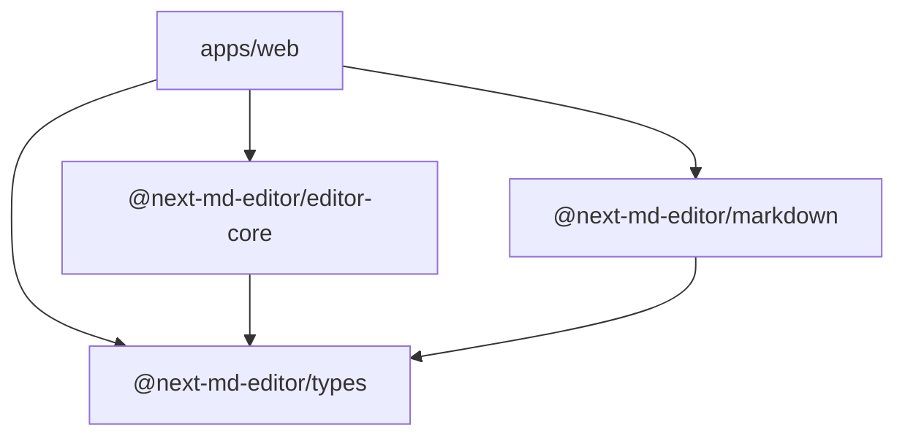

# ⚡ Next MD Editor

A professional-grade, beautiful, block-based markdown editor built with **Next.js 16**, **React 19**, **Zustand**, and **Turborepo**. Drag, drop, edit, and export GitHub-Flavored Markdown (GFM) with a true-to-life live preview matching the exact GitHub Dark theme down to the pixel.

---

## ✨ Features

- 🎨 **Pixel-Perfect GitHub Dark Theme:** Modern, stunning, and sleek layout resembling real GitHub pages.
- ⠿ **Shape-Preserved Drag and Drop:** Seamless block reordering using `@dnd-kit` with dedicated `<DragOverlay>` to ensure dragging blocks never lose their shape.
- ↕ **Interactive Resizable Sidebars:** Fluid drag-to-resize handlers on left block palette and right preview panel with bounded width limits.
- 📝 **Hybrid Notion-Style Block Editing:**
  - Standard blocks (headings, paragraphs, dividers, blockquotes) editable inline.
  - Interactive **Code Blocks** that function as an editable `<textarea>` on focus and transition to styled syntax-highlighted codes on blur.
- 🔍 **GitHub Repository Box Preview:**
  - Renders rendered markdown or raw code inside an authentic GitHub file box mockup.
  - Fully responsive file explorer headers with real icon vectors and block counters.
- ⚡ **Late-Binding Tokenizer Syntax Highlighter:**
  - Pure-alphabet indexing parser in JS/TS.
  - Renders TypeScript, JavaScript, CSS, HTML, Bash, JSON, Python, and Rust code with custom GitHub color tokens.
  - Completely immune to HTML style attribute regex leakage.
- 📥 **Import & Demo Actions:** Load comprehensive GFM demo files instantly or upload your own `.md` markdown files.

---

## 🛠️ Monorepo Architecture

This workspace leverages **Turborepo** to orchestrate build pipelines and cache dependencies across the codebase:



### Core Workspace Modules:
- **`apps/web`:** Next.js application containing components, block registries, and interactive layouts.
- **`packages/markdown`:** Independent parser and serializer package that parses markdown line-by-line into clean reactive block structures and serializes blocks back to raw markdown.
- **`packages/editor-core`:** Custom Zustand store managing block states, mutations, imports, and exports.
- **`packages/types`:** Universal TypeScript interfaces representing GFM document nodes and editor states.

---

## 🚀 Getting Started

### Prerequisites
Make sure you have Node.js (v18+) and npm installed on your system.

### Installation
Clone the repository and install dependencies at the root directory:
```bash
npm install
```

### Development Server
Spin up the local development servers for Next.js app and workspace packages simultaneously:
```bash
npm run dev
```
Open [http://localhost:3000](http://localhost:3000) in your browser to start editing!

### Production Build
Build all packages and compiles Next.js optimized bundles with Turbo caching:
```bash
npm run build
```

---

## 📖 How Code Block Syntax Highlighting Works

To maintain Next.js 16/React 19 compatibility without introducing bloated or breaking npm dependencies, the project uses a highly optimized **pure alphabetical tokenizer** in `highlighter.ts`:

1. **Escape HTML:** Safely replaces `<` and `>` tags to prevent broken layouts.
2. **Safe Index Stashing:** Comments and strings are stashed inside non-numerical keys (e.g. `__COMMENTPLACEHOLDERa__`) so subsequent keyword and number matchers never see or corrupt them.
3. **Regex Token Matchers:** Keywords, numbers, builtins, and functions are matched and wrapped in unique tags.
4. **Late-Binding Replacements:** Converts token wrappers into inline-styled spans using exact GitHub dark theme color variables in the final execution pass.

---

## 📄 License
This project is licensed under the MIT License.
