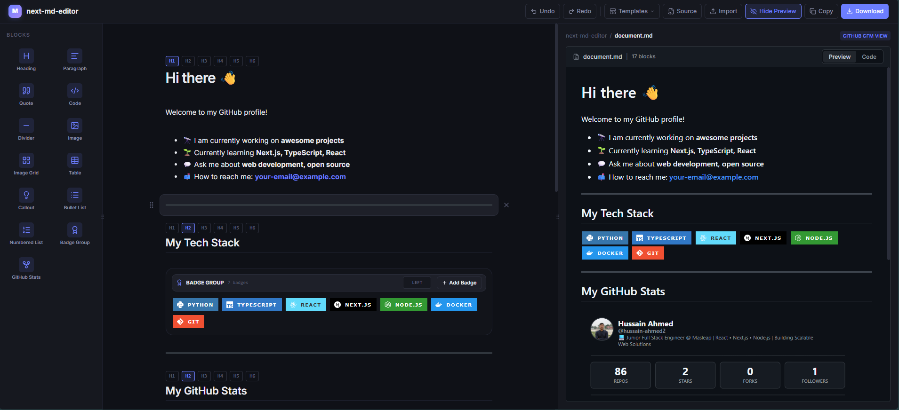

# ⚡ Next MD Editor

A professional-grade block-based visual markdown editor built with **Next.js 16**, **React 19**, **Zustand**, and **Turborepo**. Drag, drop, edit, and export GitHub-Flavored Markdown (GFM) with a live preview matching GitHub's rendering via `github-markdown-css`.

**Created by [Hussain Ahmed](https://github.com/hussain-ahmed2).**

<p align="center">
  
</p>

---

## Features

### Core Editing
- **Block-based editing** — each markdown element is a draggable, editable block
- **Drag & drop** — reorder blocks via `@dnd-kit` with `DragOverlay` preserving block shape
- **Slash commands** — type `/` in an empty paragraph to open the block-type menu (keyboard-navigable)
- **Multi-block selection** — `Shift+Click` or `Shift+Arrow` for bulk reorder, drag, and delete
- **Floating format toolbar** — appears on text selection for bold, italic, code, strikethrough, link
- **Undo/redo** — 100-level history via Zundo temporal store (`Ctrl+Z` / `Ctrl+Y`)
- **Nested lists** — full keyboard indent (`Tab`) and outdent (`Shift+Tab`) with auto-cycling numbering (1 → i → a)

### Blocks
| Block | Description |
|-------|-------------|
| Heading | H1–H6 via dropdown selector |
| Paragraph | Rich text with bold, italic, code, strikethrough, links |
| Code Block | Syntax-highlighted via highlight.js, language selector, textarea overlay for editing |
| Blockquote | Vertical bar styling |
| Callout | GitHub-flavored alerts: Note, Tip, Important, Warning, Caution |
| Bullet List | Nested unordered lists with indent/outdent |
| Numbered List | Nested ordered lists with auto-renumbering |
| Image | URL + alt text input with rendered preview |
| Image Grid | 1–8 column visual grid, inline title/description editing, caption toggles |
| Table | Editable cells, add/delete rows & columns, zebra striping |
| Divider | Horizontal rule (`---`) |

### Preview & Export
- **Live markdown preview** — renders via `react-markdown` + `remark-gfm` with `github-markdown-css` for pixel-perfect GitHub styling
- **Raw markdown viewer** — toggle between rendered preview and source
- **Resizable sidebars** — drag-to-resize with double-click to collapse
- **Import `.md` files** — upload and parse into blocks
- **Download** — export as `.md` file
- **Demo content** — loads comprehensive GFM example on page load

### GitHub Stats SVG
Generate embeddable GitHub statistics cards with multiple layout variants and theme support. Accessible via `GET /api/github/:username/stats.svg`.

| Variant | Description |
|---------|-------------|
| **Default** | Full layout: profile header, stat cards, language bar, top repos |
| **Compact** | Condensed: stat cards + language bar (no profile header) |
| **Minimal** | Bare: stat cards only |
| **Classic** | Two-column layout: stats list + language breakdown |

| Theme | Behavior |
|-------|----------|
| `auto` | CSS custom properties with `prefers-color-scheme` media query |
| `light` | Inlined light palette (works in `` tags) |
| `dark` | Inlined dark palette (works in `` tags) |

**Query parameters:** `?variant=default&theme=auto`

The editor also includes a dedicated **GitHub Stats block** that renders the same cards inline and lets you switch variant/theme via dropdown controls.

### Syntax Highlighting
- Custom late-binding alphabetical-index tokenizer
- Languages: TypeScript, JavaScript, CSS, HTML, Bash, JSON, Python, Rust
- Exact GitHub Dark theme color tokens
- Immune to HTML style attribute regex leakage

---

## Architecture

### Monorepo Structure

```
apps/web                      → Next.js 16 app (blocks, UI, registry, SVG routes)
packages/
  @next-md-editor/types       → Shared TypeScript interfaces (Block, EditorState, RichText)
  @next-md-editor/editor-core → Zustand store + BlockRegistry singleton
  @next-md-editor/markdown    → Parser/serializer (unified/remark), rich text utilities
  @next-md-editor/ui          → (stub) Shared UI components
  @next-md-editor/themes      → (stub) Multiple theme support
  @next-md-editor/mdx         → (stub) MDX support
  @next-md-editor/blocks      → (stub) Third-party block plugins
  @next-md-editor/editor-react → (stub) Drop-in React editor component
```

### Data Flow

```
Markdown ↔ Block[] ↔ Zustand Store ↔ Block Components
```

- **Parsing:** `Markdown string → unified() + remarkParse + remarkGfm → mdast → nodeToBlock() → Block[]`
- **Serialization:** `Block[] → serializeBlock() per block → clean GFM Markdown string`
- **Rendering:** `Zustand store → EditorCanvas → SortableBlock (dnd-kit) → BlockRenderer → Block component`

### Key Patterns

- **Block Registry** — singleton mapping block types to React components, serializers, and parsers
- **Rich Text Model** — `RichTextSpan[]` with manipulation utilities (merge, split, format toggle, DOM range restore)
- **Headless packages** — `editor-core` and `markdown` have zero UI dependencies; can be consumed independently

---

## Getting Started

### Prerequisites

- Node.js 18+
- npm 10+

### Installation

```bash
git clone <repo-url>
cd next-md-editor
npm install
```

### Development

```bash
npm run dev
```

Starts the Next.js dev server and all package watchers. Open [http://localhost:3000](http://localhost:3000).

### Build

```bash
npm run build
```

Builds all packages and creates an optimized production bundle.

### Other Commands

| Command | Description |
|---------|-------------|
| `npm run lint` | Lint all packages |
| `npm run test` | Run all tests |
| `npm run clean` | Clean all build outputs |

---

## Tech Stack

- **Framework:** Next.js 16 (App Router, React 19)
- **State Management:** Zustand + Zundo (undo/redo)
- **Drag & Drop:** @dnd-kit
- **Markdown:** unified, remark, rehype, react-markdown, remark-gfm
- **Styling:** github-markdown-css, Tailwind CSS v4
- **Syntax Highlighting:** highlight.js + custom late-binding tokenizer
- **Monorepo:** Turborepo
- **Database:** Prisma (PostgreSQL adapter)
- **UI Icons:** Lucide React

---

## License

MIT

## Author

[Hussain Ahmed](https://github.com/hussain-ahmed2)
