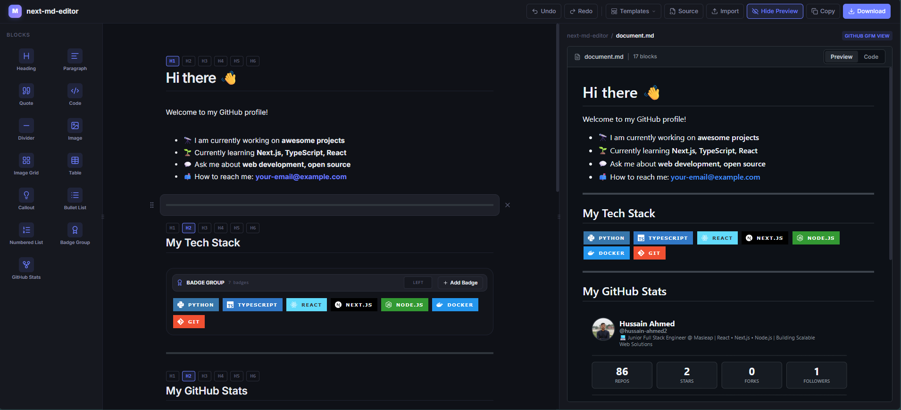

# ⚡ Next MD Editor

**The IDE for your README.** A block-based visual markdown workspace with a PyCharm-style
interface — project file tree, editor tabs, application menu bar, GitHub-accurate live preview,
embeddable GitHub stats cards, and one-click export. Local-first: your documents live in your
browser and never touch a server.

Built with **Next.js 16**, **React 19** (React Compiler), **Lexical**, **Zustand**, and **Turborepo**.

**Created by [Hussain Ahmed](https://github.com/hussain-ahmed2).**

<p align="center">
  
</p>

---

## Features

### IDE Workspace
- **Project file tree** — create, rename (F2), delete, duplicate, and drag files/folders like a
  JetBrains IDE, with context menus, keyboard navigation, and indent guides
- **Editor tabs** — multiple open files with file-type icons, dirty indicators, middle-click close
- **Application menu bar** — File / Edit / View / Help menus wired to every workspace action
- **Tool windows** — Project tree and Blocks palette on a PyCharm-style tool-window strip
- **Status bar** — file path, block/word counts, reading time, autosave state
- **Local-first persistence** — the whole workspace autosaves to `localStorage` per file;
  no account, no server round-trips (existing single-document data migrates automatically)
- **Plain-text editing** — non-markdown files (`.txt`, `.json`, `.ts`, …) open in CodeMirror
  with language highlighting; renaming `notes.md ↔ notes.txt` converts content both ways

### Editing
- **Block-based canvas** — each markdown element is a draggable, editable block (Lexical rich text)
- **Slash commands** — type `/` for a fuzzy-searchable insert menu (`/tab` → Table)
- **Floating format toolbar** — bold, italic, code, strikethrough, links on selection
- **Keyboard block ops** — `Ctrl+D` duplicate, `Ctrl+Shift+↑/↓` move, `Esc` deselect, `Del` remove
- **Drag & drop everywhere** — palette → canvas, canvas reorder, tree reorganization, and
  native OS file drop (drop `.md` files straight from your desktop)
- **Undo/redo** — 100-level history per file (`Ctrl+Z` / `Ctrl+Y`), never leaks across files
- **Source mode** — raw markdown editing in CodeMirror with apply-back parsing
- **Live preview** — GitHub's own markdown styling (`github-markdown-css`) plus mermaid diagrams
- **AI assistant** — chat panel and AI content blocks backed by OpenRouter (optional)

### Blocks
Heading, Paragraph, Quote, Code (highlight.js), Callout (GitHub alerts), Bullet/Numbered lists,
Image, Image Grid, Table (visual grid editing), Divider, Badge Group (shields.io), Smart Tech
Stack, Hero header, Project Roadmap, Contributors, GitHub Stats cards, Collapsible, AI Content.

### Import & Export
- **Import** — single `.md`/text files, whole projects from ZIP, or native OS file drop
- **Export** — active file as `.md`, standalone **HTML** (styling fully embedded, no external
  stylesheets), print-perfect **PDF** (vector text, working links), or the entire workspace as a **ZIP**

### GitHub Stats Cards
A port of [github-readme-stats](https://github.com/anuraghazra/github-readme-stats) served
from this app's own API:

| Endpoint | Card |
|----------|------|
| `GET /api/cards/stats?username=<user>` | Stats card with rank ring |
| `GET /api/cards/top-langs?username=<user>` | Top languages (`normal`, `compact`, `donut`, `donut-vertical`, `pie` layouts) |
| `GET /api/cards/pin?username=<user>&repo=<repo>` | Repository pin card |

60+ themes (`dark`, `radical`, `gruvbox`, `tokyonight`, `onedark`, `dracula`, …) and the upstream
option surface: `hide`, `show_icons`, `hide_border`, `hide_rank`, `custom_title`, gradient
`bg_color`, `border_radius`, `card_width`, `langs_count`, `layout`, `rank_icon`, `cache_seconds`,
and per-color overrides. Data is fetched via the GitHub GraphQL API (REST fallback without a
token) and cached in Postgres.

The **GitHub Stats block** is a live card configurator: pick card type, theme, and options with an
instant preview; the markdown serializer round-trips the configuration.

### GitHub Sign-in & Personal Deployments
- **Sign in with GitHub** (better-auth + Prisma) autofills your username in stats blocks
- **Deploy wizard** walks you through running your own github-readme-stats instance on Vercel
  (PAT → Vercel Deploy Button → URL verification); your cards then use your instance automatically

---

## Architecture

### Monorepo Structure

```
apps/web                      → Next.js 16 app (IDE UI, blocks, registry, API routes)
packages/
  @next-md-editor/types       → Shared TypeScript interfaces (Block, WorkspaceMeta, FileNode)
  @next-md-editor/editor-core → Zustand + zundo document store, BlockRegistry singleton
  @next-md-editor/markdown    → Parser/serializer (unified/remark), rich text utilities
  @next-md-editor/{ui,themes,mdx,blocks,editor-react} → (stubs) future packages
```

### Data Flow

```
Markdown ↔ Block[] ↔ editor store (Zustand) ↔ Lexical block components
                         ↕ per-file debounced autosave
localStorage: nme:workspace:v1 (tree, tabs) + nme:file:<id> (content)
```

- **Parsing:** `markdown → unified() + remarkParse + remarkGfm → mdast → nodeToBlock() → Block[]`
- **Serialization:** per-block serializers → clean GFM (custom blocks round-trip via HTML comment markers)
- **Workspace:** `workspaceStore` owns the tree/tabs; a persistence bridge flushes pending saves
  synchronously before any file switch so edits can never land on the wrong file

### Key Patterns

- **Block Registry** — singleton mapping block types to components, serializers, and parsers
- **Headless packages** — `editor-core` and `markdown` have zero UI dependencies
- **JetBrains design tokens** — the entire chrome is styled from CSS custom properties
  (`styles/themes/{dark,light}.css`) with shared `.ide-*` control classes

---

## Getting Started

### Prerequisites

- Node.js 20.9+ and npm 10+ (Next.js 16 requirement)
- PostgreSQL (only needed for stats-card caching and GitHub sign-in)

### Installation

```bash
git clone https://github.com/imamhossain94/next-md-editor.git
cd next-md-editor
npm install        # requires DATABASE_URL for prisma generate (see below)
npm run dev        # open http://localhost:3000
```

### Environment

Copy `apps/web/.env.example` to `apps/web/.env` and fill in what you need:

| Variable | Needed for |
|----------|------------|
| `DATABASE_URL` | Prisma (stats cache, auth sessions) |
| `GITHUB_TOKEN` | Full GraphQL stats pipeline (commits, language bytes, rank) |
| `BETTER_AUTH_SECRET`, `BETTER_AUTH_URL`, `GITHUB_CLIENT_ID`, `GITHUB_CLIENT_SECRET` | GitHub sign-in |
| `OPENROUTER_API_KEY` | AI assistant |
| `NEXT_PUBLIC_FRONTEND_URL` | Absolute card URLs in exported markdown |

The editor itself (tree, tabs, blocks, import/export) works with **no environment at all** —
documents are stored in the browser.

### Commands

| Command | Description |
|---------|-------------|
| `npm run dev` | Start dev servers (Next.js + package watchers) |
| `npm run build` | Build all packages & the web app |
| `npm run test` | Run all tests (vitest) |
| `npm run lint` | Lint all packages |
| `npm run clean` | Clean build outputs |

---

## Tech Stack

- **Framework:** Next.js 16 (App Router), React 19 + React Compiler
- **Rich text:** Lexical
- **State:** Zustand + Zundo (undo/redo)
- **Drag & Drop:** @dnd-kit
- **Markdown:** unified, remark, rehype, react-markdown, remark-gfm
- **Code editing:** CodeMirror (@uiw/react-codemirror)
- **Auth:** better-auth (GitHub OAuth, Prisma adapter)
- **Database:** Prisma 7 (PostgreSQL)
- **Compression:** fflate (ZIP import/export)
- **Styling:** CSS custom properties (JetBrains-style tokens), github-markdown-css, Tailwind v4
- **Monorepo:** Turborepo
- **Icons:** Lucide React

---

## Credits

The GitHub stats card designs, themes, and rank algorithm are adapted from
[anuraghazra/github-readme-stats](https://github.com/anuraghazra/github-readme-stats) (MIT license).

## License

MIT

## Author

[Hussain Ahmed](https://github.com/hussain-ahmed2)
